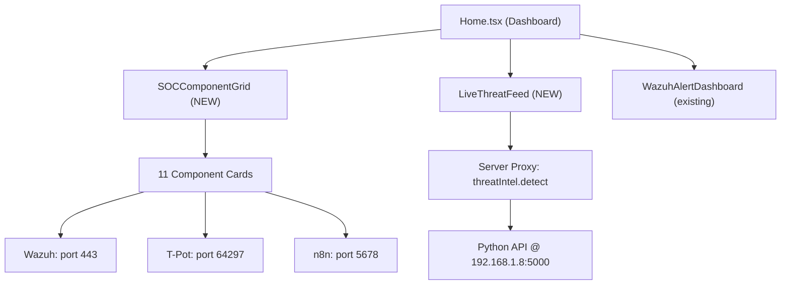

# NG-SENTRA SOC Dashboard Upgrade

Major upgrade to the dashboard home page: cybersecurity-themed component grid, real-time AI threat feed, and wired-up routing for all 11 SOC components.

---

## User Review Required

> [!IMPORTANT]
> **IP Addresses & Ports** — The plan assumes the following defaults. Please confirm or correct:
> - **Wazuh Dashboard:** `https://<host>:443` (HTTPS, port 443)
> - **T-Pot Kibana:** `https://<host>:64297`
> - **n8n SOAR:** `http://<host>:5678`
> - **Local Threat Intel API:** `http://192.168.1.8:5000` (hardcoded IP)
> - **Host IP resolution:** `window.location.hostname` for components on the same VM, or should it be a fixed IP like `192.168.1.8`?

> [!WARNING]
> **CORS for Local AI API** — Direct browser `fetch()` to `http://192.168.1.8:5000/detect` will fail due to CORS unless the Python API has CORS headers. The plan includes a **server-side proxy** route (`threatIntel.detect`) to avoid this. If your Python API already has `Access-Control-Allow-Origin: *`, we can skip the proxy.

## Open Questions

1. **Should all 11 components use the same base IP** (e.g., `192.168.1.8`) or should each card use `window.location.hostname` to resolve dynamically?
2. **Does the `/detect` endpoint require authentication** (API key, bearer token)?
3. **What is the expected JSON response shape** from `http://192.168.1.8:5000/detect`? The plan assumes:
   ```json
   {
     "threat_level": "Critical",
     "confidence": 0.92,
     "total_threats": 47,
     "recent_detections": [
       { "ip": "10.0.0.5", "type": "brute_force", "score": 0.95, "timestamp": "..." }
     ]
   }
   ```
4. **Digital Forensics Workstation** — What port/URL does SIFT run on, or is it SSH-only access?

---

## Proposed Changes

### Overview



---

### Component: CSS Enhancements

#### [MODIFY] [index.css](file:///c:/Users/ZIAD/ng-sentra/client/src/index.css)

Add cybersecurity-themed utility classes and animations:
- `@keyframes neon-pulse` — Subtle glowing pulse for active status indicators
- `@keyframes scan-line` — Horizontal scan-line effect for the threat feed header
- `@keyframes data-stream` — Vertical data-stream animation for background accents
- `.neon-border-*` utility classes for cyan/green/red/orange glow borders
- `.threat-card-*` classes for threat level color coding

---

### Component: SOC Component Grid (NEW)

#### [NEW] [SOCComponentGrid.tsx](file:///c:/Users/ZIAD/ng-sentra/client/src/components/SOCComponentGrid.tsx)

A dedicated grid component for the 11 SOC components. Each card includes:

- **Icon** (Lucide) + **name** + **category badge**
- **Status indicator** (pulsing green = running, red = stopped, orange = error)
- **Click behavior** per component type:

| # | Component | Click Action | Port/URL |
|---|-----------|-------------|----------|
| 1 | Wazuh | `window.open(https://{host}:443)` | 443 |
| 2 | Snort | Navigate to `/components/snort` (detail view) | — |
| 3 | UFW | Navigate to `/components/ufw` (detail view) | — |
| 4 | T-Pot | `window.open(https://{host}:64297)` | 64297 |
| 5 | Filebeat | Status-only card (no click action) | — |
| 6 | Anomaly Detection AI | Navigate to `/ai-models` | — |
| 7 | Alert Classification AI | Navigate to `/ai-models` | — |
| 8 | UBA AI | Navigate to `/ai-models` | — |
| 9 | Local Threat Intel AI | Status card + links to live feed | 5000 |
| 10 | n8n SOAR | `window.open(http://{host}:5678)` | 5678 |
| 11 | Digital Forensics | Navigate to `/components/dfir` | — |

**Design:**
- Dark card backgrounds (`bg-card`) with subtle gradient overlays
- Neon accent borders on hover (cyan for healthy, red for alerts)
- Top accent bar colored by category
- Animated status dot with glow effect
- Glassmorphism hover effect with `backdrop-blur`
- Responsive: 2 cols mobile → 3 cols tablet → 4 cols desktop

**URL Construction Logic:**
```typescript
const baseHost = window.location.hostname; // or configurable via settings
const buildUrl = (protocol: string, port: number) => `${protocol}://${baseHost}:${port}`;
```

This component will read from the existing `trpc.components.list` query (which already has all 11 components in the DB) and **enrich** each card with hardcoded click behaviors based on slug.

---

### Component: Live Threat Feed Widget (NEW)

#### [NEW] [LiveThreatFeed.tsx](file:///c:/Users/ZIAD/ng-sentra/client/src/components/LiveThreatFeed.tsx)

A real-time threat intelligence widget that:

1. **Polls** the backend proxy every 10 seconds via tRPC
2. **Displays** the current threat level as a large animated badge (Critical/High/Medium/Low)
3. **Shows** confidence score as a radial progress indicator
4. **Lists** recent detections in a compact scrollable feed
5. **Animates** threat level changes with color transitions

**Visual Design:**
- Full-width card with dark background
- Left section: Large threat level indicator with pulsing neon border
  - Critical = red glow + pulse
  - High = orange glow
  - Medium = yellow/amber
  - Low = green glow
- Center section: Confidence gauge (circular SVG progress ring)
- Right section: Recent detections mini-feed (last 5 entries)
- Bottom: "Last polled: Xs ago" timestamp + manual refresh button

**Error Handling:**
- If the API is unreachable, show "OFFLINE" status with red indicator
- Graceful degradation — component still renders with "No data" state
- Toast notification on first connection failure

---

### Component: Backend Proxy for Threat Intel API

#### [MODIFY] [routers.ts](file:///c:/Users/ZIAD/ng-sentra/server/routers.ts)

Add a new `threatIntel` router:

```typescript
threatIntel: router({
  detect: protectedProcedure.query(async () => {
    const { data } = await axios.get('http://192.168.1.8:5000/detect', { timeout: 5000 });
    return data;
  }),
  status: protectedProcedure.query(async () => {
    const { data } = await axios.get('http://192.168.1.8:5000/status', { timeout: 5000 });
    return data;
  }),
}),
```

This proxies the request server-side, avoiding CORS issues entirely. The URL will be read from the `system_settings` table (key: `local_ai_brain_url`) so it's configurable from Admin Settings.

---

### Component: Home Page Upgrade

#### [MODIFY] [Home.tsx](file:///c:/Users/ZIAD/ng-sentra/client/src/pages/Home.tsx)

Restructure the dashboard layout:

```
┌─────────────────────────────────────────────────┐
│  Header: "Security Operations Center" + refresh │
├─────────────────────────────────────────────────┤
│  KPI Cards Row (4 cards — existing, enhanced)   │
├──────────────────────┬──────────────────────────┤
│  LiveThreatFeed      │  AI Models Status        │
│  (NEW — full height) │  (existing, moved here)  │
├──────────────────────┴──────────────────────────┤
│  SOC Component Grid (NEW — 11 cards, 4 cols)    │
├─────────────────────────────────────────────────┤
│  WazuhAlertDashboard (existing)                 │
├─────────────────────────────────────────────────┤
│  Recent Activity (existing)                     │
└─────────────────────────────────────────────────┘
```

Changes:
- Import and render `<SOCComponentGrid />`
- Import and render `<LiveThreatFeed />`
- Enhance KPI cards with neon glow animations
- Improve section headers with scan-line effect
- Maintain all existing functionality (metrics, audit logs, Wazuh dashboard)

---

### Component: CSS Neon Animations

#### [MODIFY] [index.css](file:///c:/Users/ZIAD/ng-sentra/client/src/index.css)

Add the following to `@layer components`:

```css
/* Neon glow effects */
.neon-glow-cyan { box-shadow: 0 0 15px rgba(6, 182, 212, 0.3), inset 0 0 15px rgba(6, 182, 212, 0.05); }
.neon-glow-green { box-shadow: 0 0 15px rgba(16, 185, 129, 0.3); }
.neon-glow-red { box-shadow: 0 0 15px rgba(239, 68, 68, 0.3); }
.neon-glow-orange { box-shadow: 0 0 15px rgba(249, 115, 22, 0.3); }

/* Animated scan line */
@keyframes scan-line {
  0% { transform: translateY(-100%); }
  100% { transform: translateY(100%); }
}

/* Threat pulse */
@keyframes threat-pulse {
  0%, 100% { opacity: 1; }
  50% { opacity: 0.6; }
}
```

---

## Verification Plan

### Automated Tests
- Run existing test suite: `pnpm test` — ensure no regressions (23 tests passing)
- Type check: `pnpm check` — ensure no TypeScript errors

### Manual Verification
1. **Start dev server:** `pnpm dev`
2. **Visual inspection in browser:**
   - Verify all 11 component cards render with correct icons and status
   - Click Wazuh card → opens `https://<host>:443` in new tab
   - Click T-Pot card → opens `https://<host>:64297` in new tab
   - Click n8n card → opens `http://<host>:5678` in new tab
   - AI model cards navigate to `/ai-models`
   - Filebeat shows status-only (no click navigation)
3. **Live Threat Feed:**
   - If Python API is running: verify data appears and updates every 10s
   - If Python API is offline: verify "OFFLINE" state renders gracefully
4. **Responsive design:** Test at 375px, 768px, 1024px, 1440px widths
5. **Light/dark mode:** Toggle theme and verify neon effects adapt
